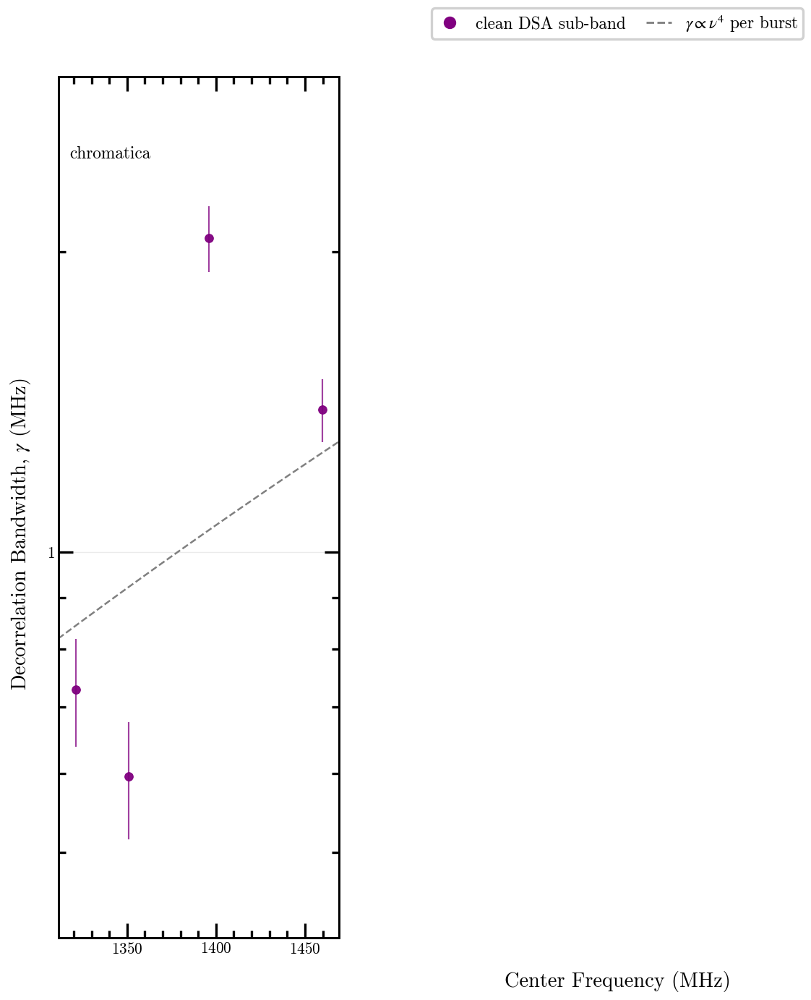
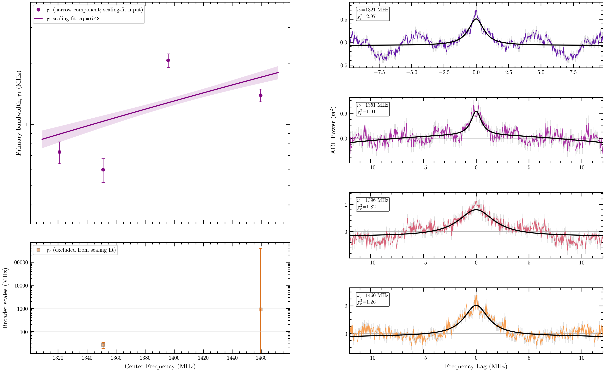

# DSA Lorentzian ACF Fit Summary

Fresh DSA ACFs were computed from the staged `.npz` dynamic spectra. Each sub-band
was fit with 1, 2, and 3 Lorentzian components; adding a component required both
strong BIC improvement and the nested-F test threshold in the existing
`compare_lorentzian_components` selector.

The number of DSA sub-bands is selected within this run, not inherited from
the checked-in burst YAML. For each burst the driver evaluates 2, 3, and 4
equal-S/N frequency splits, then chooses the largest candidate for which
every produced sub-band passes fixed viability gates: at least 512 unmasked
channels, at least an 8 MHz fitted lag window, and at least 30 positive-lag
fit samples, with at least one selected component not carrying a quality
flag. If no candidate satisfies all gates, the least pathological candidate
is retained and the fallback policy is recorded.

### CHIME artifact-control guards

CHIME upchannelized (gen-3) products carry instrumental structure that an
ACF fit can mistake for scintillation (see
`docs/rse/specs/experiment-freya-chime-instrumental-origin.md`). For
`telescope: chime` this driver applies fail-closed guards and records them
per sub-band in the JSON: (1) the coarse-channel **harmonic mask**
(`analysis.fitting.harmonic_mask`) is applied to the fit-window ACF before
the selector and the number of removed comb lag bins is recorded; (2) a
**provenance gate** requires grid regularization, bandpass normalization,
and the harmonic mask all be enabled; (3) an **off-pulse ACF null** refits
burst-free noise slices on the identical sub-band channels and fails when
they reproduce the on-pulse decorrelation scale; (4) a **low-lag excision**
check refits after dropping the first few channel lags and fails when the
width collapses (no resolved wing). The **harmonic-mask systematic** (fit
with vs without the mask) is reported as a systematic band, not a
correction. A CHIME burst is a `measurement` only if the provenance gate,
the off-pulse null, and the low-lag stability all pass; otherwise it is
`diagnostic_only`. DSA-band results are never demoted by these guards (no
DSA config enables the harmonic mask, so the DSA fit is unchanged).

## Burst Overview

| burst | selected subbands | preferred n by subband | plurality n | median dnu by component (MHz) | status | selection note |
|---|---:|---|---:|---|---|---|
| chromatica | 4 | [1, 2, 1, 2] | 1 | c1=1.059 | measurement | largest viable candidate |

## Paper Summary Figure

The sample-level summary shows one bandwidth-scaling panel per
burst. Filled circles are clean selected Lorentzian bandwidth
measurements; dashed guides are shown only when at least two
distinct clean sub-band frequencies anchor the fixed
$\gamma\propto\nu^4$ scaling. Selected components with quality
flags remain in the tables and per-burst diagnostics.

## Component Rows

| burst | subband | freq MHz | n | component | dnu MHz | dnu err | m | redchi | flags |
|---|---:|---:|---:|---:|---:|---:|---:|---:|---|
| chromatica | 0 | 1321.063 | 1 | 1 | 0.728457 | 0.0898 | 0.7594 | 2.969 |  |
| chromatica | 1 | 1351.097 | 2 | 1 | 0.595714 | 0.0801 | 0.7605 | 1.006 |  |
| chromatica | 1 | 1351.097 | 2 | 2 | 26.6806 | 7.98 | 1.018 | 1.006 | dnu_exceeds_fit_window |
| chromatica | 2 | 1395.889 | 1 | 1 | 2.06527 | 0.158 | 0.9898 | 1.821 |  |
| chromatica | 3 | 1459.620 | 2 | 1 | 1.38918 | 0.101 | 1.482 | 1.263 |  |
| chromatica | 3 | 1459.620 | 2 | 2 | 902.406 | 3.91e+05 | 20.29 | 1.263 | dnu_exceeds_fit_window;fractional_dnu_err_gt_1;modulation_gt_3;fractional_mod_err_gt_1 |

## ACF Fit Figures

Each burst figure follows the Freya instrumental-origin experiment's
publication layout: a fitted bandwidth-frequency relation beside
stacked symmetric-lag ACF panels, with the selected Lorentzian model
overlaid in black. When available, the tracked time-frequency joint
PBF fit supplies a second predicted bandwidth curve using C1=1.16.
These figures remain diagnostic until the
upstream Phase 0 producer/ACF/fitting validation passes.

### chromatica

