# DSA Lorentzian ACF Fit Summary

Fresh DSA ACFs were computed from the staged `.npz` dynamic spectra. Each sub-band
was fit with 1, 2, and 3 Lorentzian components; adding a component required both
strong BIC improvement and the nested-F test threshold in the existing
`compare_lorentzian_components` selector.

The number of DSA sub-bands is selected within this run, not inherited from
the checked-in burst YAML. For each burst the driver evaluates 2, 3, and 4
equal-S/N frequency splits, then chooses the largest candidate for which
every produced sub-band passes fixed viability gates: at least 512 unmasked
channels, at least an 8 MHz fitted lag window, and at least 30 positive-lag
fit samples, with at least one selected component not carrying a quality
flag. If no candidate satisfies all gates, the least pathological candidate
is retained and the fallback policy is recorded.

## Burst Overview

| burst | selected subbands | preferred n by subband | plurality n | median dnu by component (MHz) | selection note |
|---|---:|---|---:|---|---|
| casey | 4 | [1, 2, 1, 2] | 1 | c1=3.227, c2=18.39 | rejected n=3: subband 0 has no unflagged selected component |
| chromatica | 4 | [1, 2, 1, 2] | 1 | c1=1.059 | largest viable candidate |
| freya | 2 | [1, 1] | 1 | c1=11.91 | rejected n=2: subband 1 has no unflagged selected component n=3: subband 0 has no unflagged selected component n=4: subband 0 has no unflagged selected component |
| hamilton | 4 | [1, 1, 2, 2] | 1 | c1=0.223, c2=17.4 | largest viable candidate |
| isha | 2 | [1, 1] | 1 | c1=0.6716 | rejected n=2: subband 0 has no unflagged selected component n=3: subband 0 has no unflagged selected component n=4: subband 0 has no unflagged selected component |
| johndoeII | 3 | [1, 1, 1] | 1 | c1=1.877 | rejected n=4: subband 0 has no unflagged selected component |
| mahi | 3 | [1, 1, 1] | 1 | c1=1.835 | rejected n=4: subband 1 has no unflagged selected component |
| oran | 4 | [1, 1, 1, 2] | 1 | c1=1.025 | largest viable candidate |
| phineas | 3 | [1, 1, 1] | 1 | c1=7.044 | rejected n=4: subband 1 has no unflagged selected component |
| whitney | 2 | [1, 1] | 1 | c1=23.37 | rejected n=2: subband 0 has no unflagged selected component n=3: subband 0 has no unflagged selected component n=4: subband 0 has no unflagged selected component |
| wilhelm | 4 | [1, 1, 1, 2] | 1 | c1=0.7069, c2=14.71 | largest viable candidate |
| zach | 4 | [1, 2, 2, 2] | 2 | c1=0.668, c2=18.68 | largest viable candidate |

## Paper Summary Figure

The sample-level summary shows one bandwidth-scaling panel per
burst. Filled circles are clean selected Lorentzian bandwidth
measurements; dashed guides are shown only when at least two
distinct clean sub-band frequencies anchor the fixed
$\gamma\propto\nu^4$ scaling. Selected components with quality
flags remain in the tables and per-burst diagnostics.

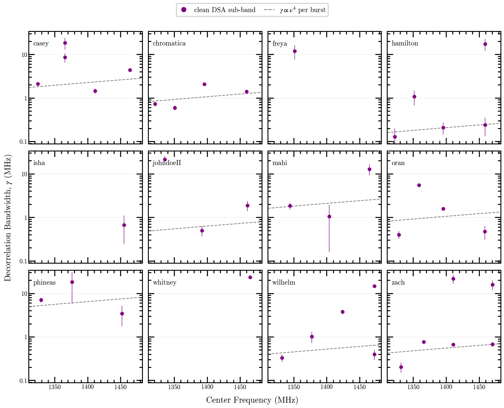

## Component Rows

| burst | subband | freq MHz | n | component | dnu MHz | dnu err | m | redchi | flags |
|---|---:|---:|---:|---:|---:|---:|---:|---:|---|
| casey | 0 | 1324.527 | 1 | 1 | 2.09972 | 0.163 | 0.3586 | 1.699 |  |
| casey | 1 | 1365.550 | 2 | 1 | 8.59017 | 2.1 | 0.7808 | 0.1213 |  |
| casey | 1 | 1365.550 | 2 | 2 | 18.3872 | 5.55 | 0.8785 | 0.1213 |  |
| casey | 2 | 1411.257 | 1 | 1 | 1.45498 | 0.187 | 0.2541 | 1.624 |  |
| casey | 3 | 1464.000 | 2 | 1 | 4.35445 | 0.362 | 0.8382 | 0.1126 |  |
| casey | 3 | 1464.000 | 2 | 2 | 40.8709 | 3.04 | 2.172 | 0.1126 | dnu_exceeds_fit_window |
| chromatica | 0 | 1321.063 | 1 | 1 | 0.728457 | 0.0898 | 0.7594 | 2.969 |  |
| chromatica | 1 | 1351.097 | 2 | 1 | 0.595714 | 0.0801 | 0.7605 | 1.006 |  |
| chromatica | 1 | 1351.097 | 2 | 2 | 26.6806 | 7.98 | 1.018 | 1.006 | dnu_exceeds_fit_window |
| chromatica | 2 | 1395.889 | 1 | 1 | 2.06527 | 0.158 | 0.9898 | 1.821 |  |
| chromatica | 3 | 1459.620 | 2 | 1 | 1.38918 | 0.101 | 1.482 | 1.263 |  |
| chromatica | 3 | 1459.620 | 2 | 2 | 902.408 | 3.91e+05 | 20.29 | 1.263 | dnu_exceeds_fit_window;fractional_dnu_err_gt_1;modulation_gt_3;fractional_mod_err_gt_1 |
| freya | 0 | 1351.564 | 1 | 1 | 11.9147 | 4.38 | 0.1972 | 0.9123 |  |
| freya | 1 | 1445.314 | 1 | 1 | 392.803 | 3.67e+04 | 3.099 | 0.8966 | dnu_exceeds_fit_window;fractional_dnu_err_gt_1;modulation_gt_3;fractional_mod_err_gt_1 |
| hamilton | 0 | 1321.841 | 1 | 1 | 0.12859 | 0.0714 | 0.6273 | 1.022 |  |
| hamilton | 1 | 1351.647 | 1 | 1 | 1.0663 | 0.399 | 0.6305 | 1.052 |  |
| hamilton | 2 | 1395.370 | 2 | 1 | 0.20727 | 0.0626 | 1.291 | 0.9135 |  |
| hamilton | 2 | 1395.370 | 2 | 2 | 593.766 | 8.15e+04 | 19.51 | 0.9135 | dnu_exceeds_fit_window;fractional_dnu_err_gt_1;modulation_gt_3;fractional_mod_err_gt_1 |
| hamilton | 3 | 1459.330 | 2 | 1 | 0.238746 | 0.109 | 1.381 | 0.9799 |  |
| hamilton | 3 | 1459.330 | 2 | 2 | 17.3959 | 5.25 | 1.301 | 0.9799 |  |
| isha | 0 | 1361.643 | 1 | 1 | 81.2377 | 3.19e+03 | 0.8128 | 1.038 | dnu_exceeds_fit_window;fractional_dnu_err_gt_1;fractional_mod_err_gt_1 |
| isha | 1 | 1455.408 | 1 | 1 | 0.671635 | 0.428 | 0.6981 | 0.9308 |  |
| johndoeII | 0 | 1335.683 | 1 | 1 | 21.571 | 3.7 | 0.4883 | 0.8712 |  |
| johndoeII | 1 | 1392.028 | 1 | 1 | 0.493652 | 0.132 | 0.4306 | 1.33 |  |
| johndoeII | 2 | 1461.345 | 1 | 1 | 1.87701 | 0.491 | 0.3483 | 1.107 |  |
| mahi | 0 | 1344.108 | 1 | 1 | 1.83453 | 0.327 | 1.133 | 1.01 |  |
| mahi | 1 | 1404.115 | 1 | 1 | 1.04695 | 0.889 | 0.5 | 0.9465 |  |
| mahi | 2 | 1465.007 | 1 | 1 | 12.8219 | 3.59 | 0.971 | 1.011 |  |
| oran | 0 | 1328.236 | 1 | 1 | 0.4019 | 0.0831 | 0.8293 | 1.102 |  |
| oran | 1 | 1358.926 | 1 | 1 | 5.51476 | 0.276 | 1.362 | 0.1582 |  |
| oran | 2 | 1395.691 | 1 | 1 | 1.57865 | 0.127 | 1.165 | 1.01 |  |
| oran | 3 | 1458.765 | 2 | 1 | 0.470727 | 0.167 | 1.126 | 1.04 |  |
| oran | 3 | 1458.765 | 2 | 2 | 503.675 | 3.75e+04 | 20.44 | 1.04 | dnu_exceeds_fit_window;fractional_dnu_err_gt_1;modulation_gt_3;fractional_mod_err_gt_1 |
| phineas | 0 | 1329.197 | 1 | 1 | 7.04448 | 0.965 | 0.6691 | 0.9926 |  |
| phineas | 1 | 1376.187 | 1 | 1 | 18.3832 | 12.6 | 0.4924 | 1.008 |  |
| phineas | 2 | 1451.989 | 1 | 1 | 3.43488 | 1.69 | 0.5759 | 1.013 |  |
| whitney | 0 | 1371.532 | 1 | 1 | 29.4629 | 4.7 | 0.7367 | 0.9306 | dnu_exceeds_fit_window |
| whitney | 1 | 1465.297 | 1 | 1 | 23.3651 | 1.03 | 0.8266 | 0.8524 |  |
| wilhelm | 0 | 1331.975 | 1 | 1 | 0.328831 | 0.0647 | 0.1813 | 1.077 |  |
| wilhelm | 1 | 1377.514 | 1 | 1 | 1.01454 | 0.295 | 0.116 | 1.109 |  |
| wilhelm | 2 | 1424.122 | 1 | 1 | 3.78017 | 0.436 | 0.1535 | 1.076 |  |
| wilhelm | 3 | 1472.348 | 2 | 1 | 0.399198 | 0.107 | 0.17 | 0.9144 |  |
| wilhelm | 3 | 1472.348 | 2 | 2 | 14.7145 | 0.902 | 0.2856 | 0.9144 |  |
| zach | 0 | 1331.624 | 1 | 1 | 0.203542 | 0.0518 | 0.6668 | 0.4703 |  |
| zach | 1 | 1365.840 | 2 | 1 | 0.765795 | 0.0707 | 0.8896 | 2.316 |  |
| zach | 1 | 1365.840 | 2 | 2 | 50.4557 | 105 | 1.718 | 2.316 | dnu_exceeds_fit_window;fractional_dnu_err_gt_1;fractional_mod_err_gt_1 |
| zach | 2 | 1410.769 | 2 | 1 | 0.663703 | 0.0612 | 0.6492 | 1.088 |  |
| zach | 2 | 1410.769 | 2 | 2 | 21.5772 | 4.84 | 0.4632 | 1.088 |  |
| zach | 3 | 1470.318 | 2 | 1 | 0.672222 | 0.0854 | 0.6868 | 1.843 |  |
| zach | 3 | 1470.318 | 2 | 2 | 15.7765 | 4.01 | 0.4192 | 1.843 |  |

## ACF Fit Figures

Each burst figure follows the Freya instrumental-origin experiment's
explanatory layout: a bandwidth summary, explicit validation context,
and spacious positive-frequency-lag ACF panels with the selected
Lorentzian model overlaid. These figures remain diagnostic until the
upstream Phase 0 producer/ACF/fitting validation passes.

### casey

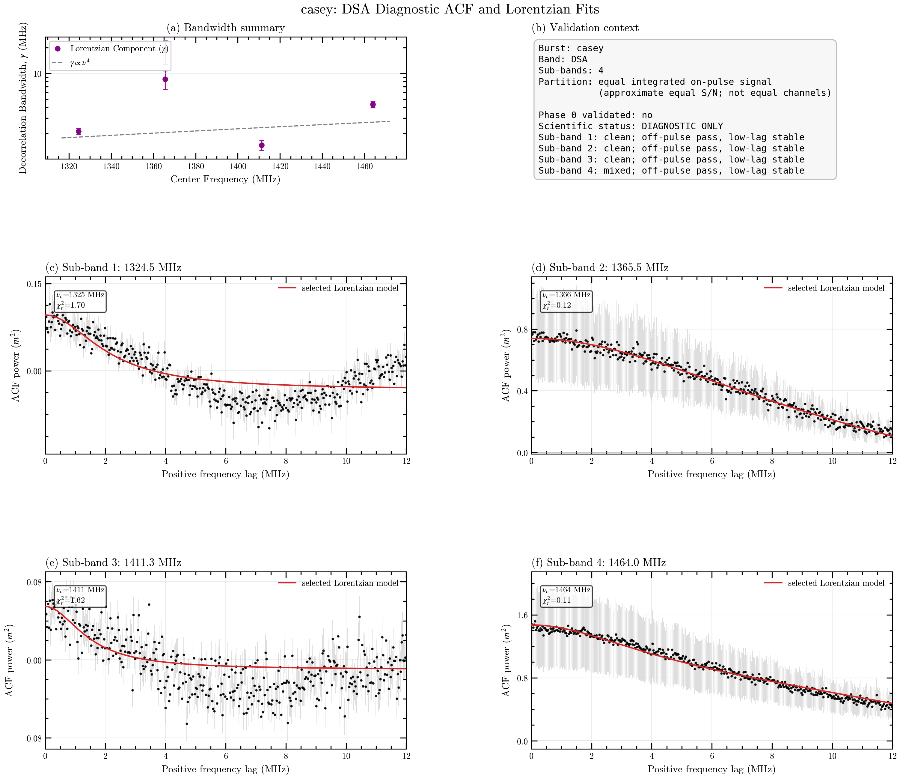

### chromatica

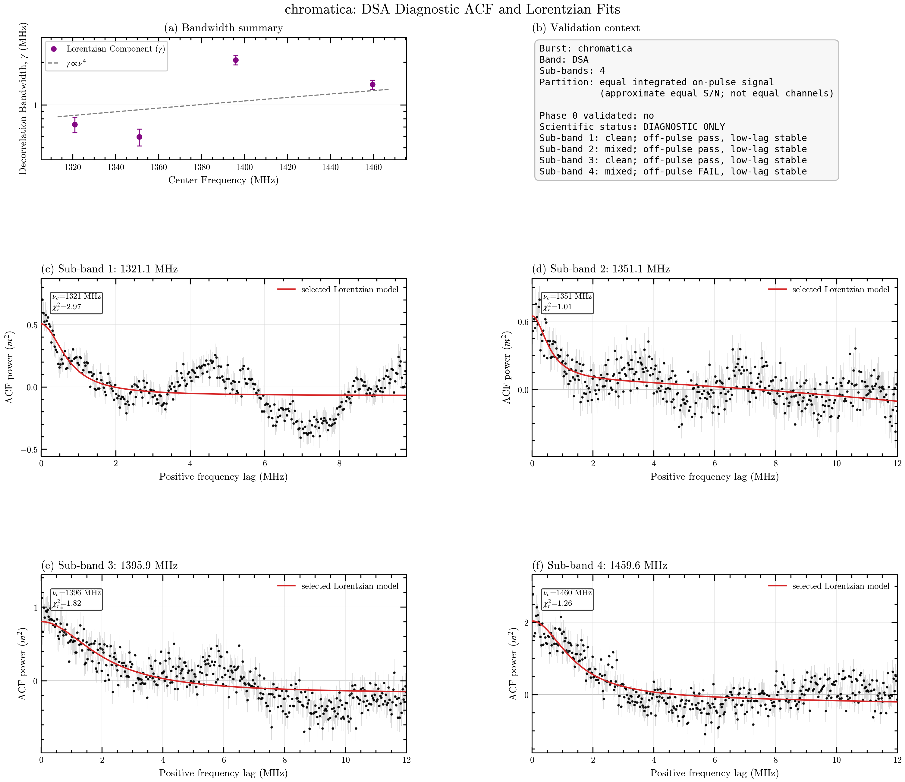

### freya

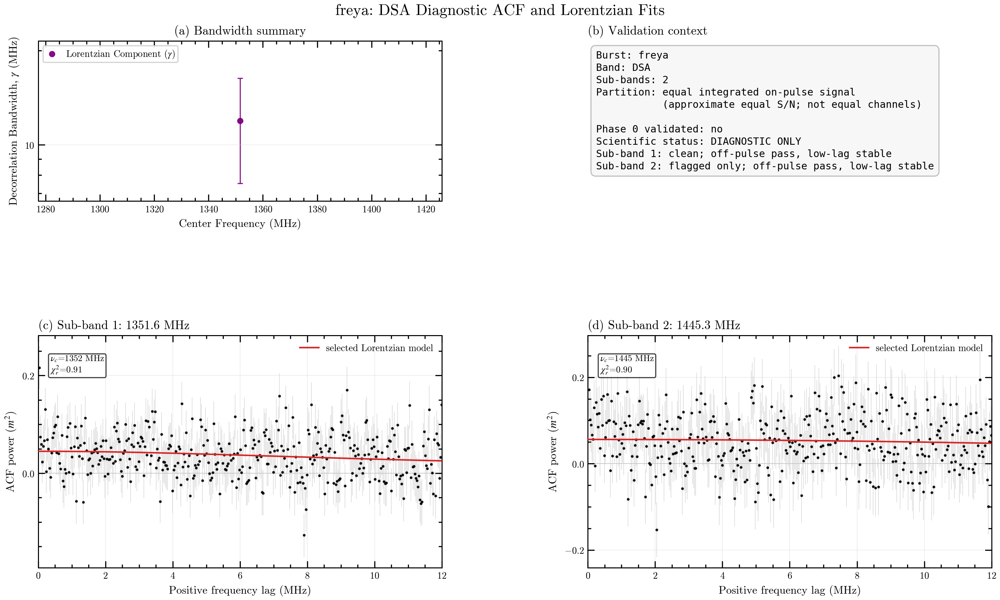

### hamilton

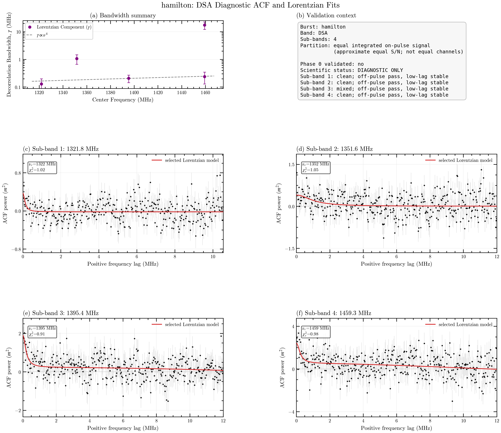

### isha

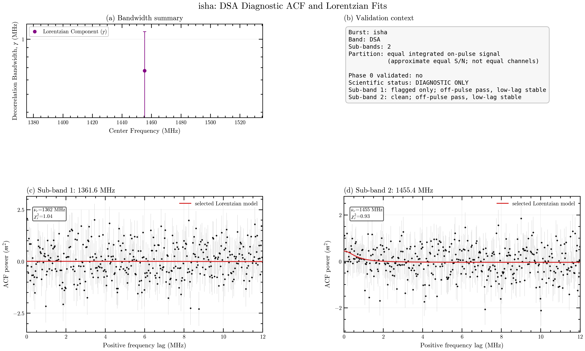

### johndoeII

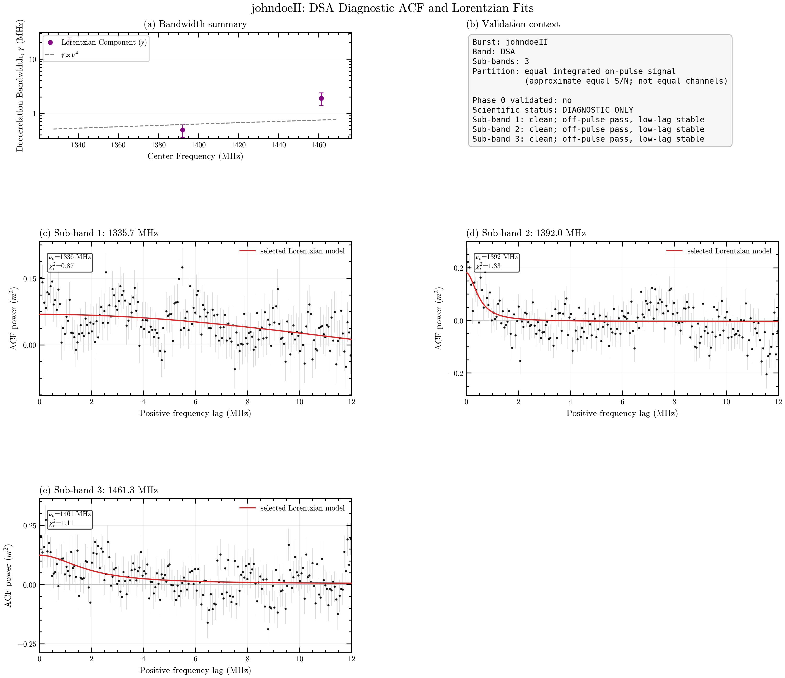

### mahi

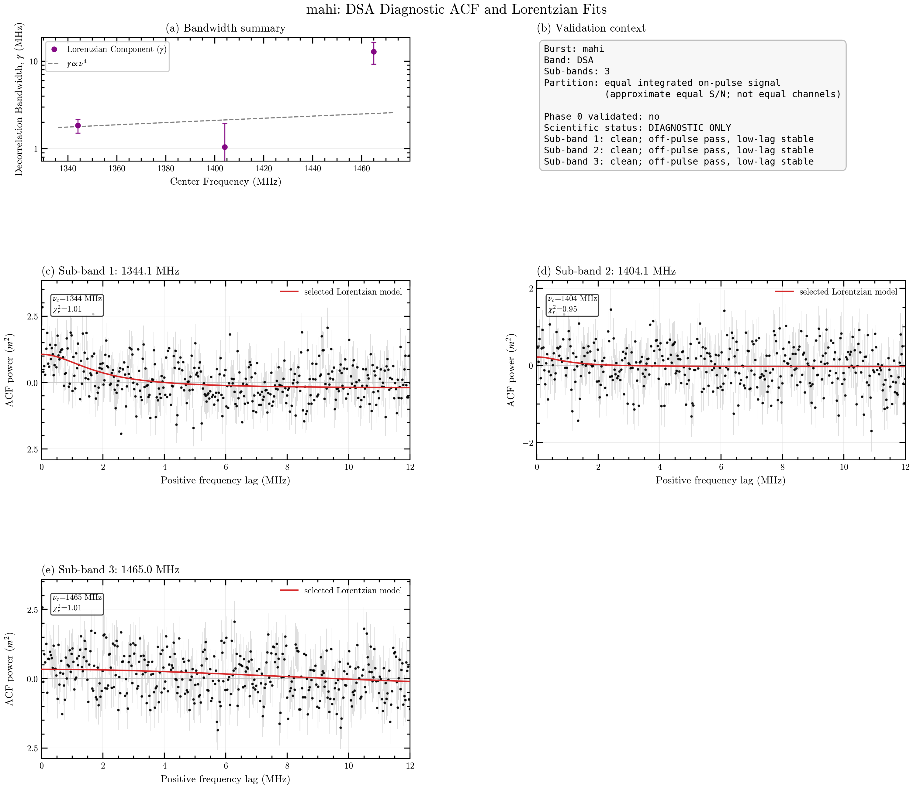

### oran

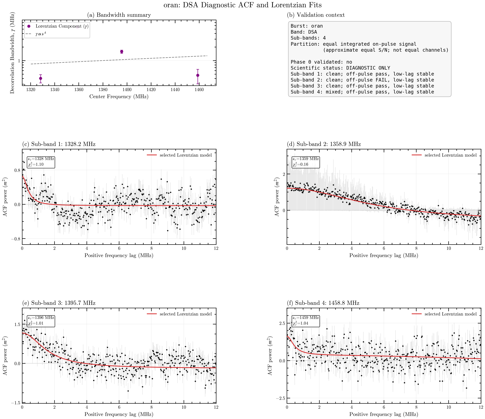

### phineas

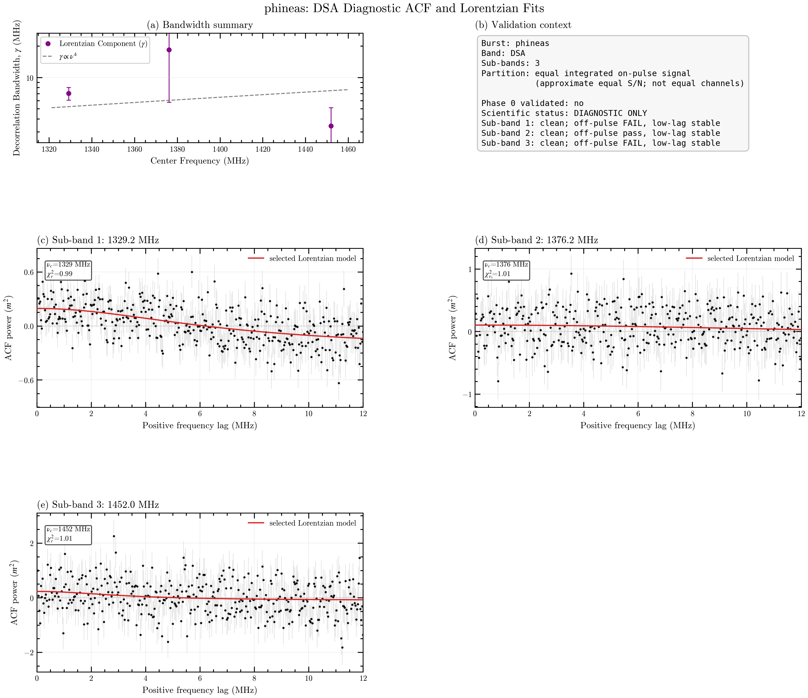

### whitney

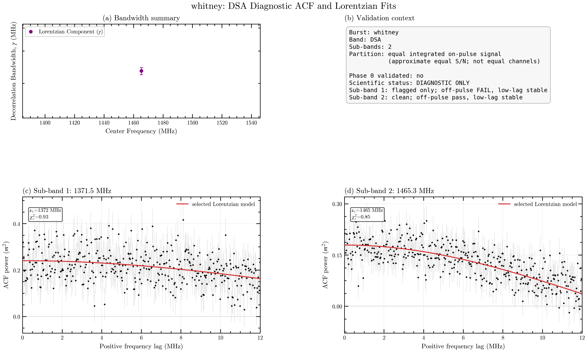

### wilhelm

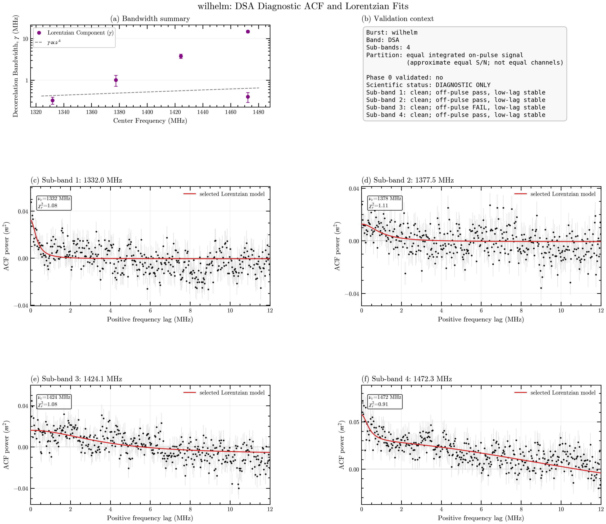

### zach

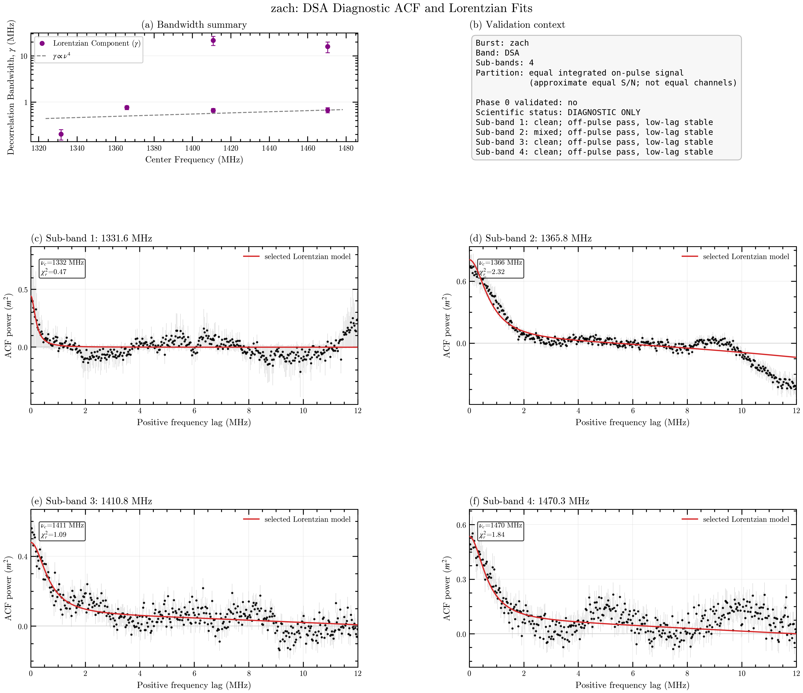
