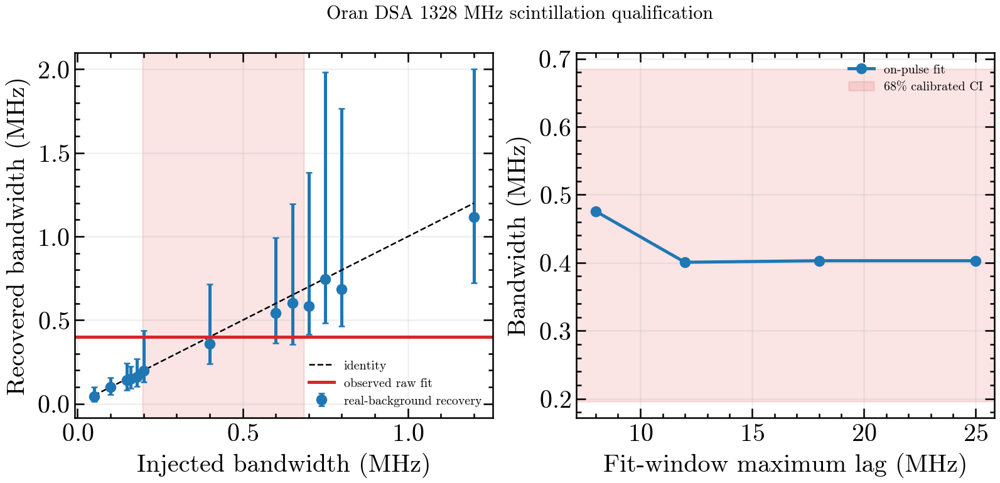

# Qualified Oran DSA scintillation bandwidth

The low-frequency DSA subband of Oran (FRB 20220506D) yields a qualified
Lorentzian-HWHM decorrelation bandwidth

\[
\Delta\nu_d(1328.24\ \mathrm{MHz}) = 0.446\ \mathrm{MHz},
\qquad 68\%\ \mathrm{CI} = [0.196,\ 0.685]\ \mathrm{MHz}.
\]

The direct bounded fit is 0.40065 MHz. The reported value and interval are
obtained by inverting a deterministic real-background injection response over
13 truth widths (1,024 total trials; 256 at 0.40 MHz). This replaces the
under-covering formal fit uncertainty with the empirically calibrated interval.

## Qualification gates

- **Independent off-pulse null:** pass. The on-pulse fixed-width Lorentzian
  amplitude is 0.5967 +/- 0.1067 (5.59 sigma). Twelve disjoint off-pulse
  controls have maximum absolute significance 2.33 sigma, and the on-pulse
  amplitude is 5.42 times the largest absolute off-pulse amplitude.
- **Fit-window stability:** pass. Fits over 8, 12, 18, and 25 MHz maximum lag
  span 0.4759, 0.4006, 0.4029, and 0.4029 MHz; fractional movement is 0.187,
  below the fixed 0.20 threshold.
- **Low-lag stability:** pass. Removing the first one, two, and three channel
  lags changes the width by factors 1.033, 0.923, and 0.996.
- **Simulation calibration:** pass. Median response is strongly monotonic
  (Spearman rho=0.989), all 256 central trials are finite, and central
  modulation recovery passes its fixed tolerance.
- **Resolved interval:** pass. The 68% lower limit is 6.4 native channels and
  the interval closes below the estimator's 2 MHz upper bound.

The input spectrum is provenance-locked by SHA-256
`ea056d3c53f5f237e5d7cbd340e7a39263fd11a9874bcb5fbb11160d3e7681b9`.
The full trial records and gate values are in `validation.json`.

## Scope

This is a DSA-110 measurement for Oran, not a recovery of the weak Freya CHIME
bandwidth. The qualified result therefore supports the Faber2026 DSA
scintillation analysis while the Freya CHIME route remains diagnostic-only.

