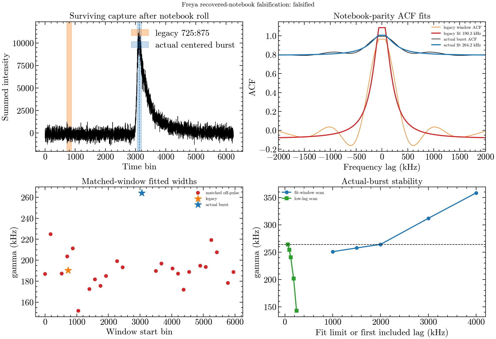

# Matched-window falsification of the 190 kHz replay peak

## Verdict

**Falsified.** The replayed `190.329 +/- 11.999 kHz` feature is an
off-pulse/instrumental scale, not a CHIME scintillation measurement.

The decisive discovery is geometric. In the surviving pickle, the notebook's
crop produces 6,250 time bins and its roll places the burst peak at bin 3,125.
The inherited integration window `725:875` is therefore off-pulse. Running the
notebook-parity estimator on that off-pulse window exactly reproduces the
reported replay fit:

```text
gamma = 190.32938857410502 +/- 11.999066051609995 kHz
R-squared = 0.8999128822085175
```

This is not an approximate reimplementation result. The accelerated FFT ACF
was tested against the archived helper's overlap-normalized lag arithmetic to
machine precision, and the fit reproduces the executed notebook value.

## Battery

The test uses the same 150-bin integration length and the notebook's spectrum,
lag convention, unconstrained `lmfit` Lorentzian, 30.51757812 kHz channel
spacing, and nominal 2 MHz fit window. It compares:

- the inherited `725:875` window;
- the actual burst-centered window `3050:3200`;
- 24 matched off-pulse windows outside a two-window burst buffer;
- burst-window shifts of +/-75, +/-150, and +/-300 bins;
- fit limits of 1, 1.5, 2, 3, and 4 MHz;
- first included lags of 2, 3, 4, 6, and 8 fine channels;
- the two frequency halves independently.

Off-pulse whiteness uses a 64-lag portmanteau test plus a maximum normalized-ACF
threshold. A pass requires `p >= 0.01` and `max |rho| sqrt(N) <= 4.5`.

## Results

| Gate | Result | Evidence |
| --- | --- | --- |
| Legacy window contains burst | **FAIL** | burst peak 3125; legacy window 725:875 |
| Off-pulse ACF is white | **FAIL** | 0/24 matched windows white; all `p = 0` numerically |
| On/off width separation | **FAIL** | actual burst 264.18 kHz; off median 189.33 kHz; ratio 1.40 (<2) |
| Fit-window stability | pass | max/min width ratio 1.43 |
| Low-lag stability | pass, marginal | 264.18 -> 142.59 kHz by first lag 8; max/min ratio 1.85 |
| Split-band stability | pass | 266.74 versus 223.12 kHz; ratio 1.20 |

The 24 off-pulse fitted widths span 151.87--224.82 kHz and cluster around the
legacy value. The actual burst-centered fit is also non-white (`p = 0`,
`max |rho| sqrt(N) = 113.7`) and has a Lorentzian baseline of 0.793: its ACF
does not approach an uncorrelated baseline within the fitted region. Its
apparently precise `264.18 +/- 9.22 kHz` width is therefore not physical
evidence merely because `R-squared = 0.966`.

The shifted windows remain in the same broad family (200.94--247.36 kHz), and
the fitted width grows from 250.83 to 358.54 kHz as the fit range expands from
1 to 4 MHz. These are further signatures of persistent spectral covariance.



The complete machine-readable record is
[`matched-window-falsification.json`](matched-window-falsification.json).

## Scientific consequence

The recovered-notebook route is now closed for a CHIME measurement:

1. The 190 kHz value was measured off-pulse.
2. Matched off-pulse spectra reproduce the same characteristic scale.
3. No matched off-pulse spectrum is statistically white.
4. Moving to the true burst window changes the fitted number but does not
   remove the instrumental covariance.

No further post-hoc fit to this detected-intensity product should be promoted
as a scintillation bandwidth. The remaining credible paths are:

- earlier-chain injection/recovery through upchannelization, detection,
  alignment, and correction, if the raw/intermediate products are available;
- otherwise, use CHIME as an upper-limit or scintillation-quenching constraint
  and let DSA carry the measured bandwidths.

## Reproduction

```bash
python scintillation/scint_analysis/reference_arc/replay_falsification.py \
  /path/to/freya_278720455_fullstokes_interp.pkl \
  /path/to/output-directory
```

Input SHA-256:
`69ec55d93f2705999da7975448311114b573641561e60d4b939bf3de3a476356`.

Output SHA-256 values:

```text
26f2710fe490ef28bc920a185a8657743a0425d77bc6920853fd4bdd5508d7ad  matched-window-falsification.json
8e52b558c81014b18a1140c35dd30aacf933dbabfa3687034ede562574d949c1  matched-window-falsification.png
```
