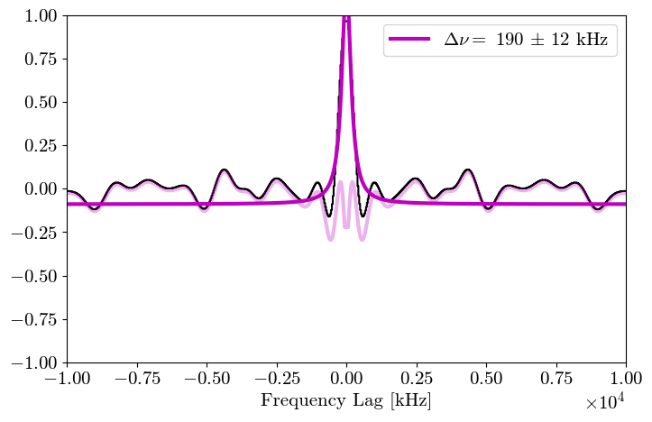
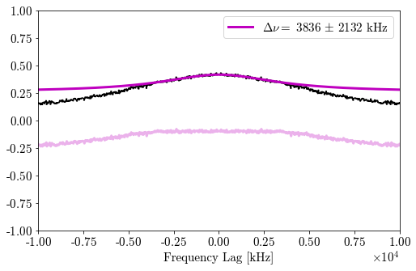

# `scint_freya.ipynb` recovery replay (2026-07-14)

## Adjudication

The recovered notebook executes from beginning to end under Python 3.8.19
without changing any notebook cell. It does **not**, however, reproduce the
notebook's stored result. The surviving same-named data file and closest
recovered helper module are not the exact assets used to produce the stored
outputs.

The replay therefore establishes that the old workflow is executable, but it
is not an exact historical reproduction and its fitted bandwidth must not be
promoted as a validated CHIME scintillation measurement without the usual
off-pulse and instrumental controls.

## Immutable inputs and reconstructed environment

| Item | SHA-256 / version | Provenance |
| --- | --- | --- |
| `scint_freya.ipynb` | `88057737a24273f9d5593996f810c5f4b3de31da2ff23af72eeaae1065ec0907` | Byte-identical to the recovered ARC and h17 archive copies |
| `scinttools.py` | `2b70029152d8336f0f7a59f75f4415998f2c73d994670f439a3fdf33b404dd16` | Recovered from the notebook's VOSpace `scint/old/` directory |
| effective `burstfittools.py` | `42d722c57e6f5c81f1d503d8584e47972a2e76be5b4a61adbdd42137ce294b8b` | Recovered as `burstfittools_old.py`; it has the two-argument `fit_models(model, init_params)` API required by the notebook |
| surviving `freya_278720455_fullstokes_interp.pkl` | `69ec55d93f2705999da7975448311114b573641561e60d4b939bf3de3a476356` | Same-named candidate under the renamed VOSpace `OLD_CHIME_DSA_Codetections/CHIME_pkl/` tree |
| Python | `3.8.19` | Exact notebook kernel version |
| container base | `python:3.8.19-slim-bullseye`, digest `sha256:c94b5d2bc6440a48099ae82cd1bed6d25093af28c18dc4bf59d05dc76fcb5b09` | Isolated Linux execution surface |

The reconstructed Python environment used NumPy 1.24.4, SciPy 1.10.1,
Matplotlib 3.7.5, lmfit 1.2.2, emcee 3.1.4, corner 2.2.1, Astropy 5.2.2,
and the notebook execution stack nbconvert 7.16.4 / ipykernel 6.29.5. Only
Python 3.8.19 is recorded in the notebook; the package versions are compatible
reconstruction pins, not a recovered lock file. Astropy is required to
unpickle the surviving input even though the notebook does not import it.

The source notebook and helper modules were mounted read-only. The surviving
pickle was mounted read-only at the notebook's original absolute path:

```text
/arc/home/jfaber/baseband_morphologies/CHIME_DSA_Codetections/CHIME_pkl/
freya_278720455_fullstokes_interp.pkl
```

## Replay result

The full notebook ran all cells, including all four MCMC model fits and the
13,082-lag autocorrelation. The ACF cell returned:

```text
gamma1 = 190.329389 +/- 11.9990661 kHz
R-squared = 0.89991288
reduced chi-square = 0.00743618
c = -0.08950190 +/- 0.01040394
```

The subsequent structure-function cell reported 0.27465820308 MHz.



The executed inline notebook is retained outside git at:

```text
/Users/jakobfaber/Data/Faber2026/dsa110/reference_notebook_20260714/
output/scint_freya.executed-inline.ipynb
```

Its SHA-256 is
`ba631a09f7ea48187b281b86a620e0516c49d6145217d437cc1cf4d41f77f6f8`.

## Why this is not the stored run

Two independent checks prove that the surviving assets differ from the assets
that produced the notebook's stored outputs:

1. The replayed input crops to `(13082, 6250)`. The stored cell output says the
   historical input cropped to `(6144, 1562)`.
2. The closest recovered two-argument helper runs 1,000 MCMC steps. The stored
   progress bars run 200 steps.

The stored notebook reports a much broader and poorly constrained fit:

```text
gamma1 = 3836.00587 +/- 2132.12621 kHz
R-squared = 0.67289989
reduced chi-square = 5.4980e-05
```



The archived panel is dominated by a broad, smooth spectral shape, whereas the
surviving-file replay contains a narrow central feature. They are plainly not
the same dynamic spectrum. The deleted original absolute path is not present
in VOSpace, and no earlier same-named pickle or exact 200-step, two-argument
helper was found in the local or h17 recovery archives.

## Scientific status

- **Execution:** completed and reproducible for the enumerated surviving
  assets.
- **Exact historical replay:** not achieved; the historical data/helper state
  is missing.
- **Archived 3.8 MHz fit:** remains a failure-quality, broad instrumental-shape
  fit.
- **Replayed 190 kHz fit:** numerically well determined for the surviving input,
  but the follow-up matched-window battery has now **falsified** it as a
  scintillation measurement. The hard-coded `725:875` integration is off-pulse
  in the surviving capture, and all 24 matched off-pulse ACFs are non-white and
  reproduce the same scale family. See [`FALSIFICATION.md`](FALSIFICATION.md).
